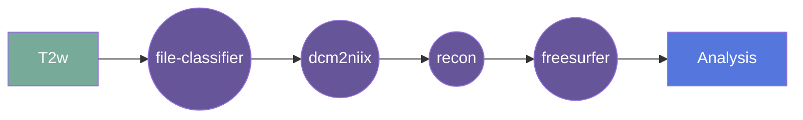

# WMH-synthseg

This gear runs WMH-synthseg available in Freesurfer version 8.1.0 (Ubuntu22). This is the out-of-the-box version that runs convolutiona neural networks for segmentation.

## Overview

[Usage](#usage)

[FAQ](#faq)

### Summary
Takes an isotropic image and runs WMH-synthseg on it. The output includes a volume estimation file (csv), a probability map of lesions (nii.gz), and a segmentation file (nii.gz).

The output file labels are based on the BIDS standard, taking the input file name and appending the appropriate suffixes. For example if the input file is `sub-01_ses-01_T1w.nii.gz`, the output files will be named `sub-01_ses-01_desc-wmhsynthseg.nii.gz`, `sub-01_ses-01_desc-wmhsynthseg_probabilities.nii.gz`, and `sub-01_ses-01_desc-wmhsynthseg_volumes.csv`.
### Cite

**license:**

**url:** <https://github.com/UNITY-Physics/fw-wmh-synthseg>

**cite:**  
Quantifying white matter hyperintensity and brain volumes in heterogeneous clinical and low-field portable MRI. Laso P, Cerri S, Sorby-Adams A, Guo J, Matteen F, Goebl P, Wu J, Liu P, Li H, Young SI, Billot B, Puonti O, Sze G, Payabavash S, DeHavenon A, Sheth KN, Rosen MS, Kirsch J, Strisciuglio N, Wolterink JM, Eshaghi A, Barkhof F, Kimberly WT, and Iglesias JE. Proceedings of ISBI 2024 (in press).

### Classification

*Category:* analysis

*Gear Level:*

* [ ] Project
* [x] Subject
* [x] Session
* [ ] Acquisition
* [ ] Analysis

----

### Inputs

* api-key
  * **Name**: api-key
  * **Type**: object
  * **Optional**: true
  * **Classification**: api-key
  * **Description**: Flywheel API key.

### Config

* input
  * **Base**: file
  * **Description**: input file (usually isotropic reconstruction)
  * **Optional**: false

### Outputs
* output
  * **Base**: file
  * **Description**: segmentated file 
  * **Optional**: false

* probability
  * **Base**: file
  * **Description**: probability file (nii.gz)
  * **Optional**: true

* vol
  * **Base**: file
  * **Description**: volume estimation file (csv)
  * **Optional**: true

#### Metadata

No metadata currently created by this gear

### Pre-requisites

- Three dimensional structural image

#### Prerequisite Gear Runs

This gear runs on BIDS-organized data. To have your data BIDS-ified, it is recommended
that you run, in the following order:

1. ***dcm2niix***
    * Level: Any
2. ***file-metadata-importer***
    * Level: Any
3. ***file-classifier***
    * Level: Any

#### Prerequisite

## Usage

This section provides a more detailed description of the gear, including not just WHAT
it does, but HOW it works in flywheel

### Description

This gear is run at either the `Subject` or the `Session` level. It downloads the data for that subject/session and then runs the
`WMH-SynthSeg` pipeline on it.

After the pipeline is run, the output folder is zipped and saved into the analysis
container.

#### File Specifications

This section contains specifications on any input files that the gear may need

### Workflow

A picture and description of the workflow

Description of workflow

1. Upload data to container
2. Prepare data by running the following gears:
   1. file classifier
   2. dcm2niix
   3. Multi-Resolution Reconstruction (MRR) {for Hyperfine Swoop data}
3. Run the recon-all-clinical gear
4. Output data is saved in the container
5. 
### Use Cases

## FAQ

[FAQ.md](FAQ.md)

## Contributing

[For more information about how to get started contributing to that gear,
checkout [CONTRIBUTING.md](CONTRIBUTING.md).]

## Changelog
[For more information about the changes to this gear over time,
checkout [CHANGELOG.md](changelog.md).]
